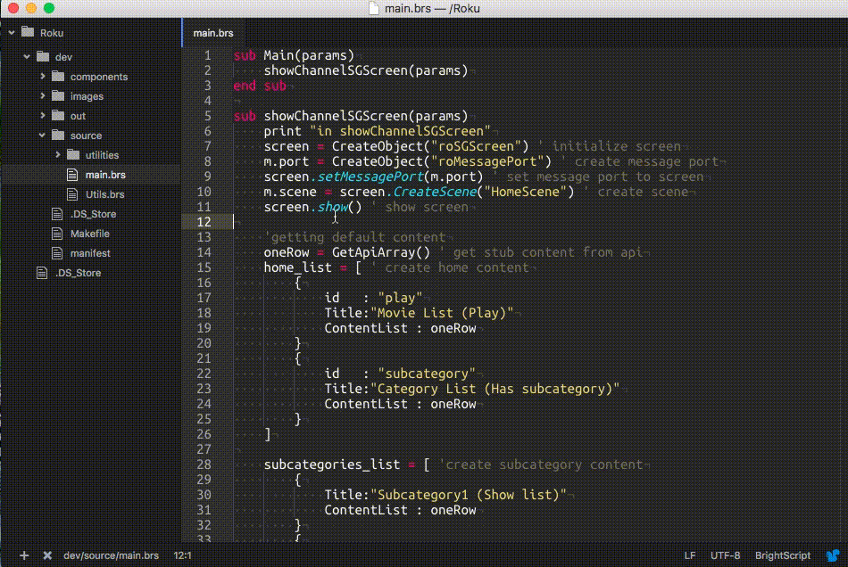
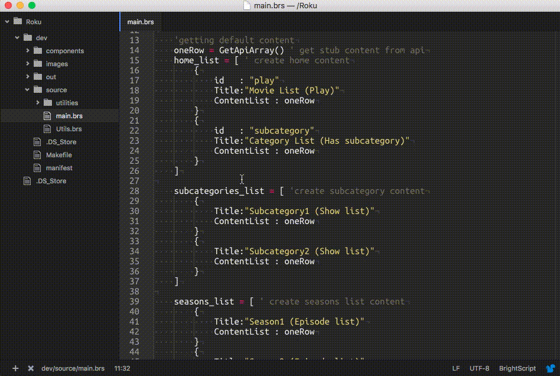
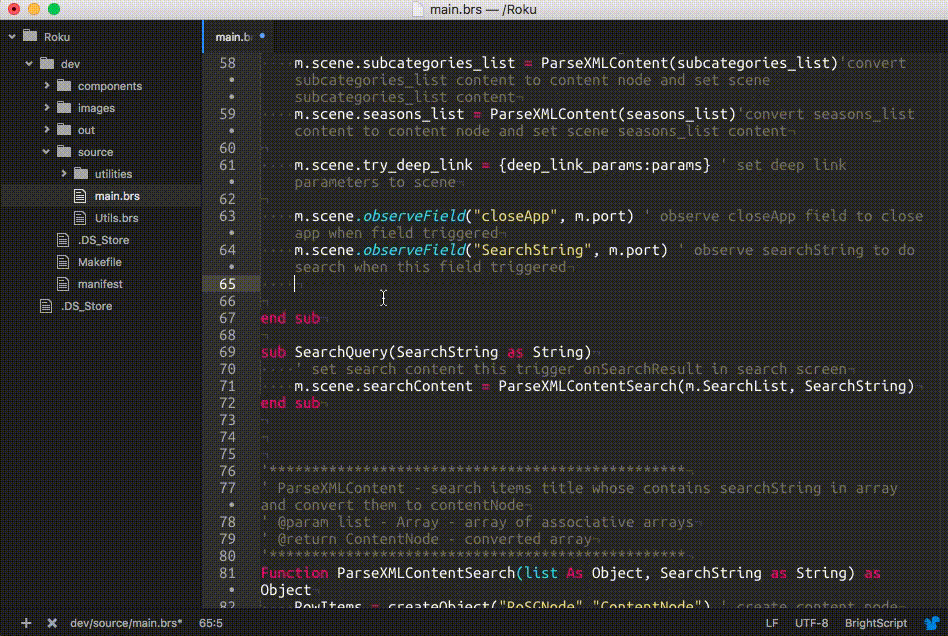
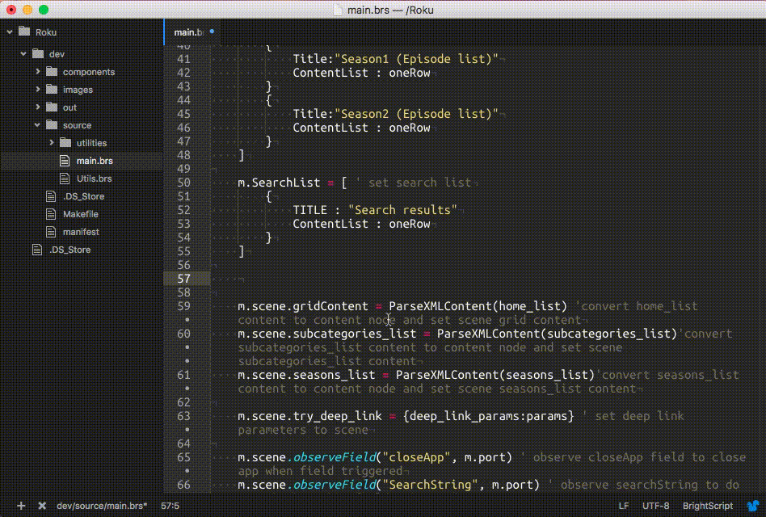

# Roku Atom
The package for Atom IO Text Editor

## Features
   - Full BrightScript syntax highlight support.
   - Autocompletion of SceneGraph components XML layout.
   - Roku autocompletion of SDK components, fields, global functions, etc.
   - If/For/While/etc. autoclosing feature.
   - Code analysis for debug breakpoints on deploy.
   - Deploy to Roku box from editor.

## Preview

**General overview:** Syntax highlighting, Deploy, etc.

**Code sample:** for-each autocomplete

**Code sample:** while loop autocomplete

**Code sample:** global functions autocomplete

